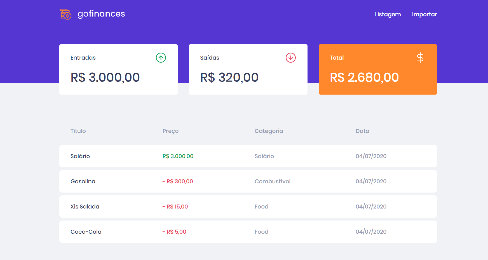

# GoFinances 💰
Aplicação para controle de financas desenvolvida durante o bootcamp GoStack da Rocketseat🚀

### Front-end: ReactJS, Typescript
### Backend: NodeJS, TypeORM, PostgresSQL

----------------------------------------------------

----------------------------------------------------

## Instalação | Execução

Clone esse repositório rodando:

    git clone https://github.com/MarthinKorb/Desafio-Fundamentos-Reactjs

Criar um banco de dados Posgtres com nome:

    gofinances

Abra o terminal na pasta **backend** e instale as dependências rodando o comando:

    yarn

Ainda na pasta **backend**, rode as migrations para criação das tabelas no database rodando o comando:

    yarn typeorm migration:run

Já podemos dar o start no nosso servidor rodando o comando:

    yarn dev:server

----------------------------------------------------

Abra o terminal na pasta **frontend**, instale as dependências rodando o comando:

    yarn

Agora vamos iniciar nosso front-end:

    yarn start

**Feito!** ✔

----------------------------------------------------

